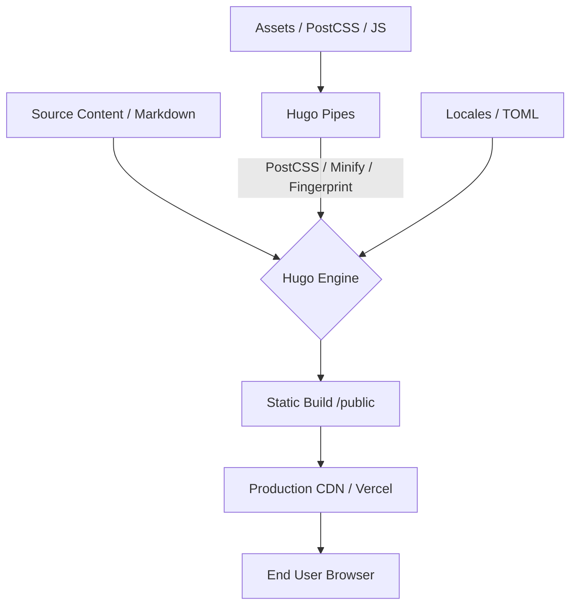

# Vilkor Digital Estate - Institutional Documentation

Institutional-grade landing page built with a high-performance Jamstack architecture, focusing on typography, architectural rigor, and an organic "Digital Estate" aesthetic.

## 🛠 Tech Stack

- **Engine:** [Hugo](https://gohugo.io/) (Static Site Generator - Extended version)
- **Styling:** Tailwind CSS (Native Integration via PostCSS)
- **Logic:** Vanilla JavaScript (ES6+) with Modular Components
- **Animation:** AOS (Animate on Scroll) & Custom CSS Keyframe Atmospheres
- **Deployment:** Vercel (CI/CD Pipeline automated via `main` branch)

## 🎨 Visual Excellence & Atmospheric Design

The project transcends standard SaaS layouts, implementing a **"Digital Estate"** tonal architecture:

- **Living Glow Systems:** Dynamic atmospheric lighting in critical sections (e.g., FAQ) using elliptical radial gradients that cycle through corporate brand colors (Emerald, Electric Blue, Mystic Purple).
- **Glassmorphism & Depth:** Premium glass surfaces with dynamic blurs and subpixel borders to ensure structural clarity.
- **Iconography:** Adaptive material symbols that respond to theme switches (Light/Dark mode) with optimized contrast ratios.

## 🏗 System Architecture



## 🌍 Global Presence (i18n)

Native multilingual support implemented via Hugo's translation engine:

- **Supported Locales:** English (`en`), Spanish (`es`), Portuguese (`pt`).
- **Translation Hub:** Managed in `site/locales/i18n/*.toml`.
- **Granular Control:** All UI elements, from CTA badges to technical specifications, are fully localized and build-time resolved.

## 🛡 Governance & Security

### Branch Protection
To maintain the "Golden Demo" integrity and ensure production stability:
- **Direct push to `main` is prohibited.**
- All changes must be proposed via **Pull Requests**.
- One approving review is required for merging.
- Force pushes and deletions are restricted.

### Content Hardening
- **Anti-Copy Directives:** Intelligent content selection prevention in production.
- **Form Integrity:** Secure AJAX handling via Static Forms with environment-level API key management.

## 🚀 Development Workflow

1. **Local Environment:**
   ```bash
   npm run dev
   ```
   *Runs the Hugo server with live reload and PostCSS processing.*

2. **Production Build:**
   ```bash
   npm run build
   # or
   hugo --gc --minify
   ```

## 📁 Project Structure

- `site/content/`: Narrative content and page structure.
- `site/layouts/partials/`: Modular components (Hero, Solutions, FAQ, etc.).
- `site/locales/i18n/`: Multilingual dictionaries.
- `site/assets/`: Core styles and JavaScript logic.
- `site/static/`: High-resolution assets and media.

---

**Maintained by:** Vilkor Engineering Team  
**Design Authority:** Google Stitch / Digital Estate Standards  
**Last Synchronized:** May 5, 2026
