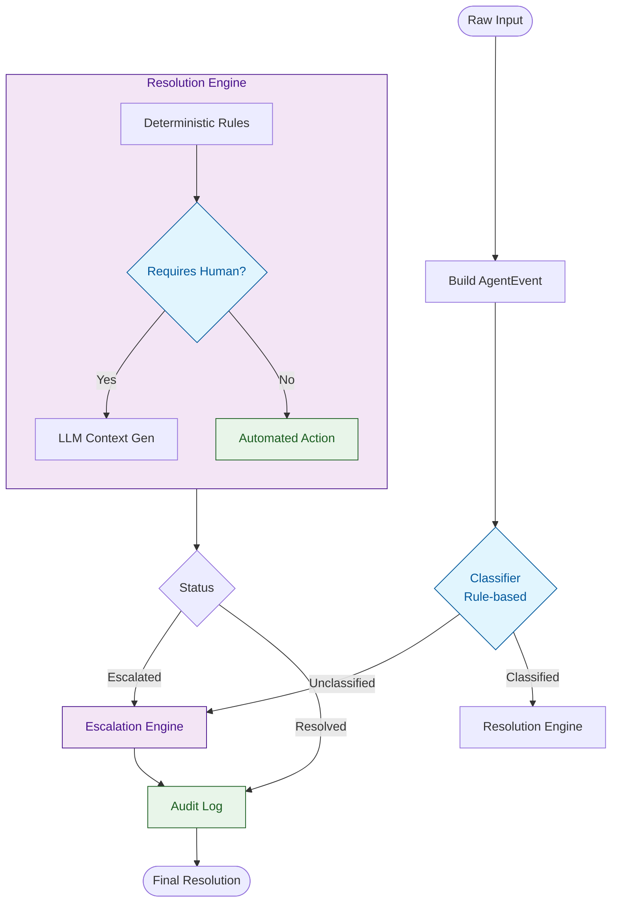
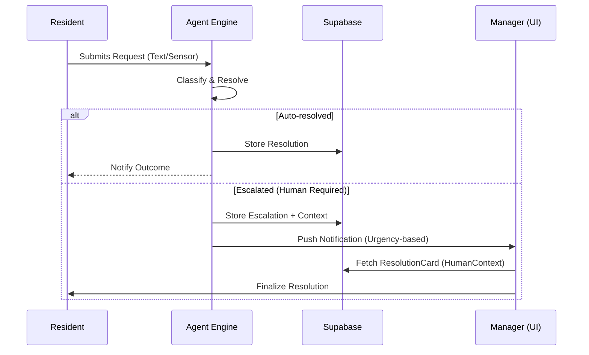
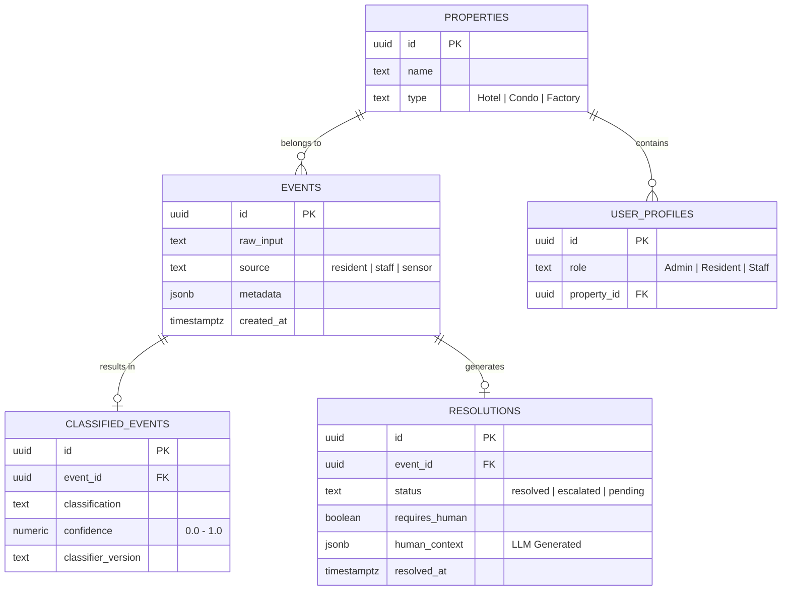

# CantonAlfa (Evolution of PropertyPulse)

**CantonAlfa** is a state-of-the-art residential management platform built on the philosophy of **Zero-Friction Management**. It digitizes every physical interaction within a residential community into a single, unified, and highly delegable interface.

> Correct build order: **UI Prototype (throwaway) → Agent Engine → Supabase Schema → Production UI**  
> North Star KPI: `AgentResolutionRate` > 80% | `units_per_manager` ratio

---

## 🧠 Core Architecture: The Agent Engine

CantonAlfa is powered by an autonomous resolution loop designed for high reliability and deterministic routing. Unlike traditional "black box" AI, our agent uses a hybrid approach: **Rule-based Classification** for speed/certainty and **LLM-assisted Context** for human handoffs.

### The Resolution Loop


### Interaction Sequence


---

## 📊 Database Design

Our schema is derived directly from the agent's data requirements, ensuring that every byte stored contributes to the **AgentResolutionRate** KPI.



---

## 🛠 Tech Stack
- **Frontend**: Vite 6 + React 19 + TypeScript.
- **Styling**: Vanilla CSS (High-end Editorial Aesthetic).
- **Backend**: Supabase (PostgreSQL + RLS + Edge Functions).
- **Intelligence**: Rule-based Decision Trees + LLM (Anthropic/Gemini) for Synthesis.
- **Architecture**: Domain-Driven Design (DDD) with a central Agent Loop.

## 🚀 Development Phases

| Phase | Goal | Definition of Done |
|---|---|---|
| **Phase 0** | **UI Prototype** | Throwaway app validating manager click-flow and card layout. |
| **Phase 1** | **Agent Engine** | Working `processEvent` loop with 100% test coverage and LLM stubs. |
| **Phase 2** | **Supabase** | Schema migration, RLS policies, and real persistence layer. |
| **Phase 3** | **Production UI** | High-fidelity dashboard reading directly from the agent loop. |

---

## 🧪 Setup & Development

### Prerequisites
- Node.js (Latest stable)
- Supabase CLI (for Phase 2+)

### Running Locally
```bash
npm install
npm run dev
```

### Documentation Links
- [AGENTS.md](AGENTS.md) — Detailed Engineering Development Process & Rules.
- [implementationPlan.md](implementationPlan.md) — Current sprint and task tracking.

---
*CantonAlfa: The Operating System for Modern Living.*
