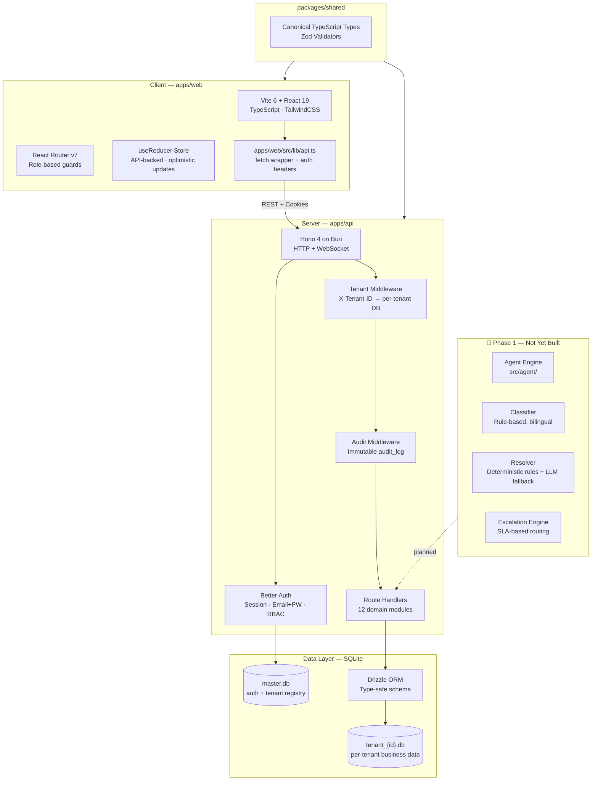
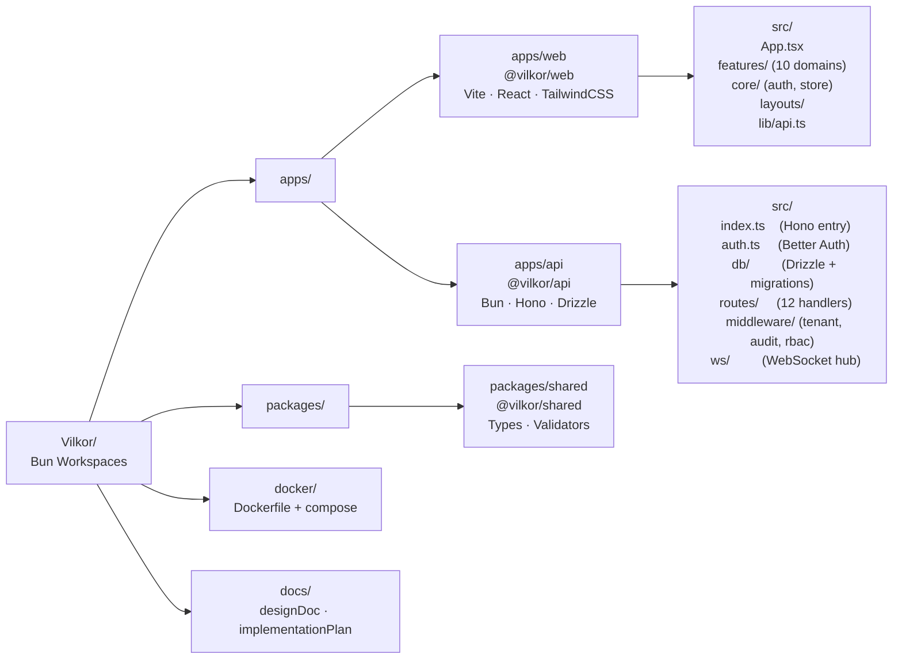
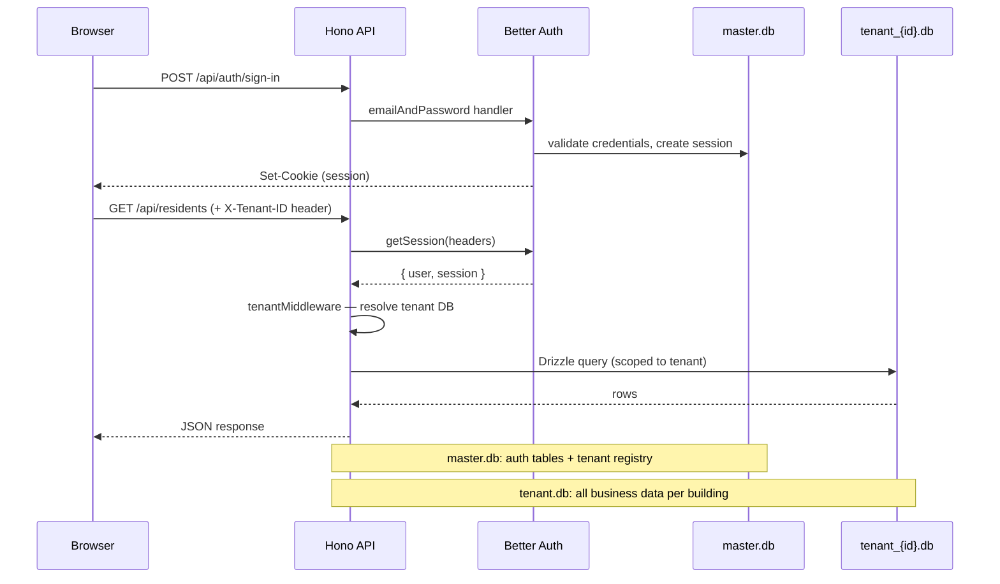
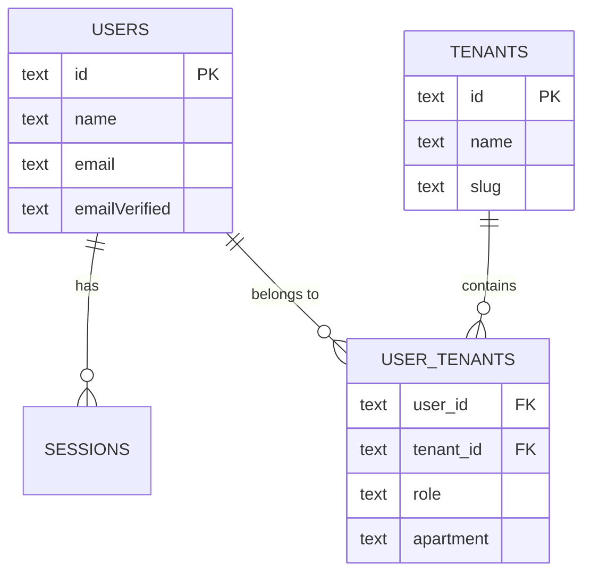
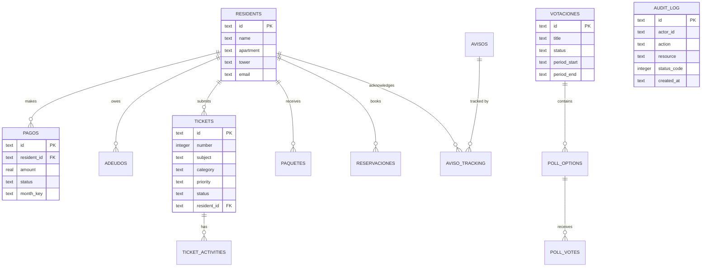
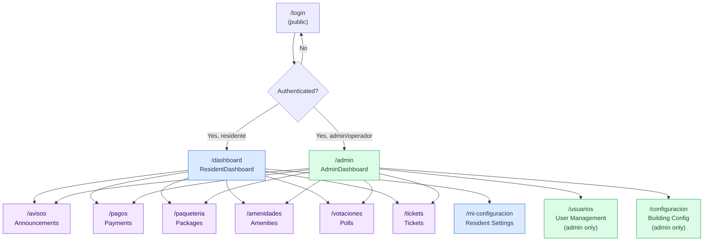
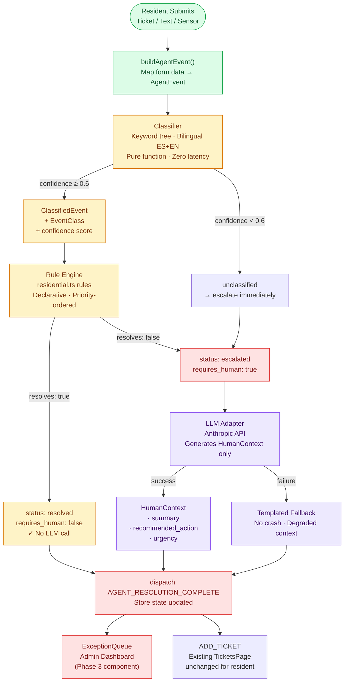
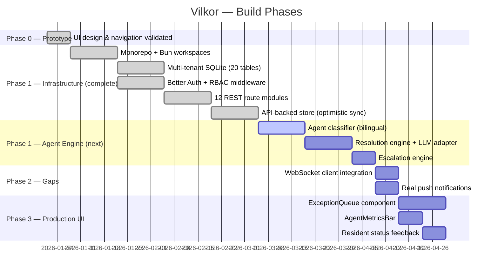

# Vilkor — Vilkor

**Vilkor** is a multi-tenant residential property management SaaS. It digitizes every physical interaction within a residential community — payments, tickets, amenity bookings, package tracking, governance polls, and resident communications — into a single, unified, and highly delegable interface.

> North Star KPI: `AgentResolutionRate` > 80% | `units_per_manager` ratio  
> Build order: **Phase 0 ✅ → Phase 1 (current) → Phase 2 → Phase 3**

---

## 🏗 Architecture Overview



---

## 📦 Monorepo Structure



---

## 🔐 Authentication & Multi-Tenancy



---

## 🗄 Database Design

Two databases, strictly separated:

### master.db — Auth & Registry



### tenant.db — Business Domain (per-building)



---

## 🌐 API Surface

| Method | Route | Description | Auth |
|--------|-------|-------------|------|
| GET | `/health` | Server health check | None |
| POST | `/api/auth/sign-in` | Email + password login | None |
| GET | `/api/me` | Current user + tenant info | Session |
| GET | `/api/residents` | List residents | Tenant |
| POST | `/api/residents` | Create resident | Admin |
| GET/POST/PATCH/DELETE | `/api/pagos` | Payments CRUD | Tenant |
| GET/POST/PATCH/DELETE | `/api/tickets` | Support tickets | Tenant |
| GET/POST/PATCH/DELETE | `/api/avisos` | Announcements | Admin |
| GET/POST/PATCH/DELETE | `/api/paquetes` | Package tracking | Tenant |
| GET/POST/PATCH/DELETE | `/api/amenidades` | Amenity bookings | Tenant |
| GET/POST/PATCH/DELETE | `/api/votaciones` | Governance polls | Tenant |
| GET/POST/PATCH | `/api/egresos` | Expenses | Admin |
| GET/POST/PATCH | `/api/inventory` | Inventory | Admin |
| GET | `/api/dashboard` | Aggregated stats | Admin |
| GET | `/api/audit` | Audit log | Admin |
| GET/PUT | `/api/config` | Building config | Admin |

All tenant-scoped routes require `X-Tenant-ID` header and valid session cookie.

---

## 🖥 Frontend Routes & Roles



---

## 🔮 Phase 1 — Agent Engine (Planned, Not Built)

The Agent Engine is the next major milestone. It will sit between the UI's ticket submission and the store/API — invisible to the resident, transforming every submission into a classified, routed event.



---

## 📊 Current Phase Tracker



---

## ✅ What Works Today / ⚠️ What Doesn't

| Area | Status | Notes |
|------|--------|-------|
| Multi-tenant auth (login/session) | ✅ Working | Better Auth + master.db |
| Per-tenant SQLite isolation | ✅ Working | `X-Tenant-ID` middleware |
| Residents CRUD | ✅ Working | Full REST + Drizzle |
| Payments (pagos) | ✅ Working | Full REST |
| Support tickets | ✅ Working | Activities, priority, status |
| Announcements (avisos) | ✅ Working | Pinning, attachments, tracking |
| Package tracking | ✅ Working | Porter flow |
| Amenity reservations | ✅ Working | Conflict detection |
| Governance polls | ✅ Working | 1-unit-1-vote enforced |
| Expenses (egresos) | ✅ Working | Admin only |
| Building config | ✅ Working | JSON document store |
| Audit log | ✅ Working | Immutable, every mutation |
| API-backed store with optimistic sync | ✅ Working | `loadStateFromAPI` + `syncActionToAPI` on every dispatch |
| WebSocket hub (server-side) | ✅ Working | Bun pub/sub, per-tenant topics |
| Docker deploy | ✅ Files exist | `docker/Dockerfile` + compose — not smoke-tested |
| **WebSocket client** | ⚠️ Not wired | Server broadcasts; web app has no `WebSocket` connection |
| **Agent classifier** | ⚠️ Not built | Phase 1 next milestone |
| **Resolution engine** | ⚠️ Not built | Phase 1 |
| **Escalation engine** | ⚠️ Not built | Phase 1 |
| **ExceptionQueue UI** | ⚠️ Not built | Phase 3 |
| **AgentMetricsBar** | ⚠️ Not built | Phase 3 |
| **Resident status feedback** | ⚠️ Not built | Phase 3 |
| **LLM context generation** | ⚠️ Not built | Phase 1 |
| **Real push notifications** | ⚠️ Not built | Unscheduled |

---

## 🛠 Tech Stack

| Layer | Technology | Purpose |
|-------|------------|---------|
| Runtime | **Bun** | JS runtime + package manager |
| API Framework | **Hono 4** | Ultra-fast HTTP + WebSocket |
| Auth | **Better Auth 1.2** | Sessions, email+pw, RBAC |
| ORM | **Drizzle ORM** | Type-safe SQLite schema |
| Database | **SQLite** (bun:sqlite) | Embedded per-tenant isolation (20 tables) |
| State | **useReducer** + React Context | Optimistic updates, API-synced on every mutation |
| Frontend | **Vite 6 + React 19** | SPA with HMR |
| Styling | **TailwindCSS 3** | Utility-first CSS |
| Routing | **React Router v7** | Client-side navigation |
| Shared types | **Zod** | Runtime validation |
| Validation | **@hono/zod-validator** | Request body validation |
| Container | **Docker** | Production deploy |
| Monorepo | **Bun Workspaces** | `apps/*` + `packages/*` |

> **No Supabase.** Auth, database, and real-time are all self-hosted via Better Auth + SQLite + Hono WebSocket. No external managed services required beyond an LLM API key (Phase 1).

---

## 🚀 Development Setup

### Prerequisites
- **Bun** ≥ 1.1 — [bun.sh](https://bun.sh)
- **Node.js** not required (Bun handles everything)

### Install

```bash
bun install
```

### Run (both apps simultaneously)

```bash
bun run dev          # starts api (port 3000) + web (port 5173)
bun run dev:api      # API only
bun run dev:web      # web only
```

### Database

```bash
# Generate new migration from schema changes
bun run --filter=@vilkor/api db:generate

# Run migrations
bun run --filter=@vilkor/api db:migrate

# Seed with demo data
bun run --filter=@vilkor/api db:seed
```

### Type-check all packages

```bash
bun run typecheck
```

### Docker

```bash
docker compose -f docker/docker-compose.yml up
```

### Environment Variables

Copy `.env.example` to `apps/api/.env`:

```bash
cp .env.example apps/api/.env
```

| Variable | Description |
|----------|-------------|
| `PORT` | API server port (default: 3000) |
| `CORS_ORIGIN` | Web app origin (default: http://localhost:5173) |
| `BETTER_AUTH_SECRET` | 32-char random string for session signing |
| `BETTER_AUTH_URL` | API base URL |
| `ADMIN_EMAIL` | Seed admin email |
| `ADMIN_PASSWORD` | Seed admin password |

---

## 🗺 Areas of Opportunity

### High Priority
- **Agent Engine** — The classifier and resolver are designed but unbuilt. This is the core differentiator of the product (Phase 1 next milestones).
- **WebSocket client** — The server-side pub/sub hub exists and broadcasts per-tenant events. The web app has zero WebSocket connection code — live updates for tickets, packages, and notifications are not working despite the infrastructure being ready.

### Medium Priority
- **Push notifications** — Notification stubs exist in the plan; real Web Push / FCM integration is unscheduled.
- **PDF receipts** — `@react-pdf/renderer` is installed but PDF generation routes aren't wired end-to-end.
- **File storage** — Receipt and attachment data is stored as base64 in SQLite (noted in schema as "Phase C: move to filesystem"). This will hit row-size limits at scale.
- **E2E test suite** — No Playwright or integration tests exist yet. Unit tests are planned for the agent layer.

### Low Priority / Future
- **LLM provider abstraction** — The plan specifies Anthropic. An adapter layer would allow swapping providers.
- **Offline support** — The PWA / IndexedDB + background sync mentioned in the design doc is not in the current architecture.
- **Multi-language UI** — The API supports bilingual classification (ES + EN) but the web UI has no i18n layer.
- **Billing / Stripe** — Mentioned in early design docs but not in the current build plan.

---

## 📚 Documentation

| File | Purpose |
|------|---------|
| [AGENTS.md](AGENTS.md) | Engineering process, phase gates, Definition of Done per milestone |
| [implementationPlan.md](implementationPlan.md) | Detailed sprint tasks, code templates, integration test scenarios |
| [docs/designDoc.md](docs/designDoc.md) | Original design document v5.0 (historical reference) |

---

*Vilkor — The Operating System for Modern Living.*
