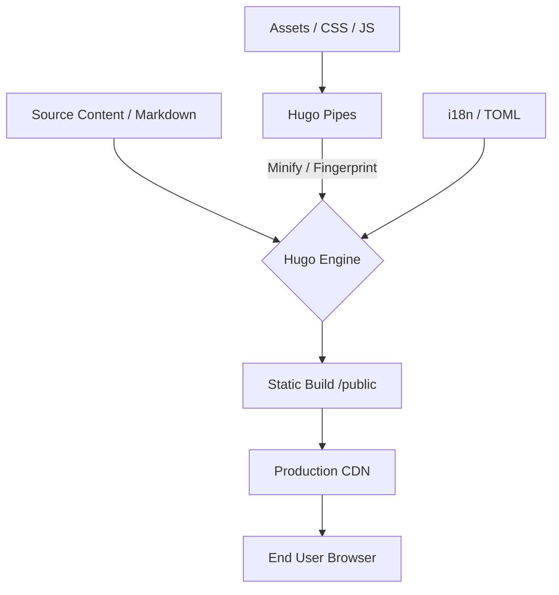
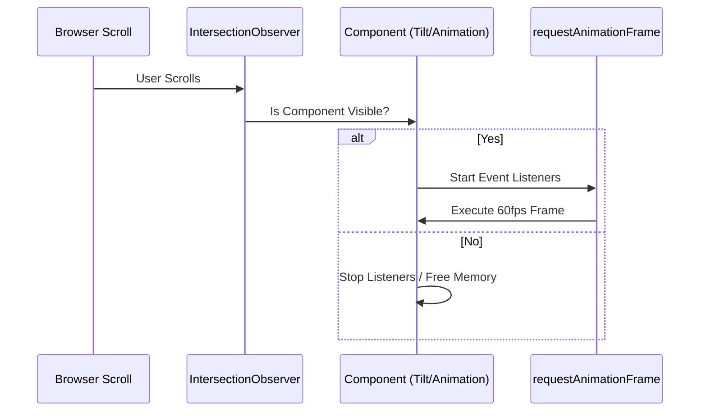

# Vilkor Digital Estate - Technical Documentation

Institutional-grade landing page built with a high-performance Jamstack architecture, focusing on typography, editorial design, and zero-latency user experience.

## 🛠 Tech Stack
- **Engine:** [Hugo](https://gohugo.io/) (Static Site Generator)
- **Styling:** Tailwind CSS (Hybrid: CDN for development + Hugo Pipes for production-ready CSS)
- **Logic:** Vanilla JavaScript (ES6+)
- **Animation:** [AOS](https://michalsnik.github.io/aos/) (Animate on Scroll)
- **Forms:** [Static Forms](https://www.staticforms.xyz/) API integration
- **Deployment:** Optimized for Vercel/Netlify/S3

## 📊 System Architecture



## 🏗 Architecture & Design System
The project follows a **"Digital Estate"** aesthetic, characterized by:
- **Tonal Depth:** Deep monochromatic backgrounds with high-contrast accents (`#674bb5` Brand Purple).
- **Grid System:** Strict adherence to a subpixel grid for structural rigor.
- **Typography:** Manrope (Headings) and Inter (Body) via Google Fonts.

## ⚡ Performance Optimizations



- **Resource Throttling:** Navigation and scroll listeners use `requestAnimationFrame` and throttling to ensure 60fps scrolling.
- **Memory Management:** 3D Tilt effects and heavy animations are wrapped in `IntersectionObserver` to prevent background CPU cycles on non-visible elements.
- **Asset Pipeline:** CSS/JS resources are minified and fingerprinted via Hugo Pipes to ensure instant cache invalidation.
- **Anti-Cache Directives:** Strict HTTP-equiv meta tags implemented to force fresh content delivery on every request.

## 🌍 i18n Strategy
The site implements a native Hugo i18n system with multi-language support:
- **Locales:** English (`en`), Spanish (`es`), Portuguese (`pt`).
- **Translation Logic:** Managed via `.toml` files in `/i18n/`.
- **Dynamic Content:** All UI strings (including security warnings) are resolved at build-time using `{{ T "key" }}`.

## 🛡 Security & Hardening
- **Content Protection:** `select-none` CSS implementation and JavaScript clipboard interceptors are conditionally injected based on the environment (`hugo.IsServer`).
- **Form Hardening:** AJAX/Fetch implementation for form submissions to prevent external redirects and maintain a seamless SPA-like success flow.
- **CSRF Mitigation:** Static Forms API key integration via environment variables.

## 🚀 Development Workflow
1. **Prerequisites:** Hugo (extended version recommended).
2. **Local Development:**
   ```bash
   npm run dev
   # or
   hugo server -D
   ```
3. **Build for Production:**
   ```bash
   hugo --gc --minify
   ```

## 📁 Project Structure
- `/content/`: Markdown sources for page logic.
- `/layouts/`: 
    - `/_default/baseof.html`: Main shell & core scripts.
    - `/partials/`: Modular UI components (Hero, Features, Pricing, etc.).
- `/i18n/`: Multilingual string definitions.
- `/resources/`: Hugo Pipes cache and build assets.
- `/static/`: Public assets (images, icons).

---
**Maintained by:** Vilkor Engineering Team
**Last Optimized:** 2026-05-02
